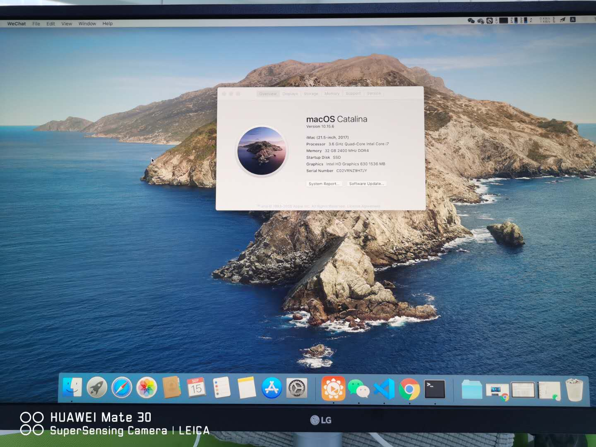
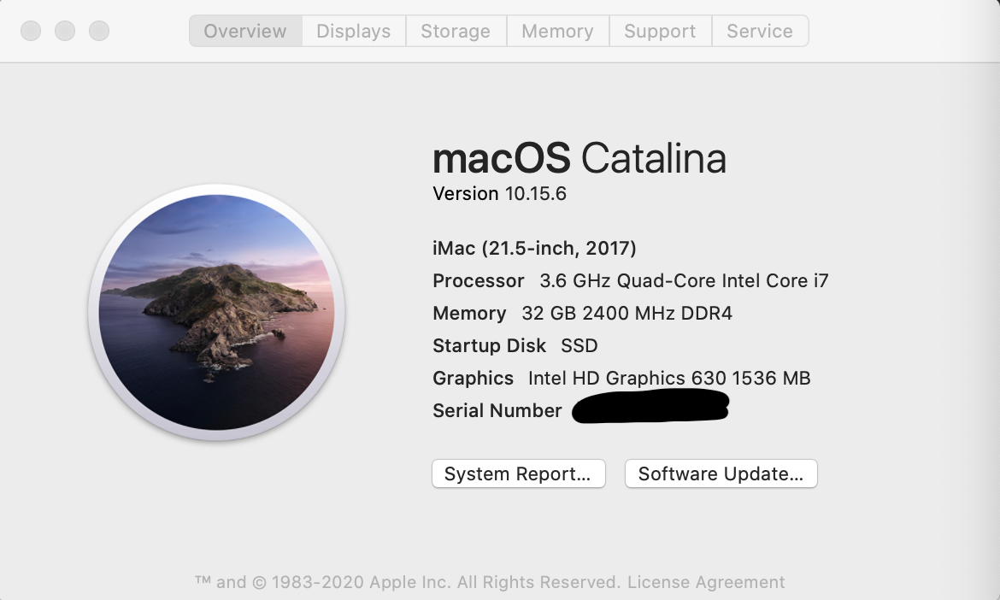

# Dell Precision Tower 3620 Hackintosh with Opencore

Credit to [Dortania's Opencore Install Guide](https://dortania.github.io/OpenCore-Install-Guide/), [Opencore Sanity Checker](https://opencore.slowgeek.com/), [ProperTree](https://github.com/corpnewt/ProperTree), [GenSMBios](https://github.com/corpnewt/GenSMBIOS), [Dell PFS Bios Extractor](https://github.com/platomav/BIOSUtilities), [UEFITool](https://github.com/LongSoft/UEFITool), [Universal IFR Extractor](https://github.com/LongSoft/Universal-IFR-Extractor), and [Apple Inc.](apple.com)

## Preview

---

## System Specs

| Part | Model Number |
| ---- | ---- |
| CPU | Intel i7-7700 (Kaby Lake) |
| Motherboard | Dell 0mwypt |
| GPU | Intel UHD Graphics 630 |
| SSD | Samsung 970 evo 256GB |
| HDD | SeaGate ST1000DM010-2EP102 1TB |
| Bluetooth | BCM94360CS 1750M|
| WiFi | BCM94360CS 1750M | 
| Ethernet | Intel I219LM |
| Display | LG 27UL550 4k |

---

## For 4k output

If you want to display 4K screen resolutions, you must set the DVMT-prealloc value to at least 64 MB. Unfortunately, there is no way to set the DVMT-prealloc value in the BIOS. Here, I modify the value through Grub Shell (OC/Tools/modGRUBShell.efi).

    # check the value
    grub> setup_var 0x350
    # modify the value to 0x2 (64MB)
    grub> setup_var 0x350 0x2

__Warning__: The value 0x350 only works on some models (e.g., *Dell Precision T3620* and *DELL-OptiPlex-7040*). You ***should not*** modify such value unless you confirm that this value applies to your machine. To get the value of your machine, you can extract your BIOS file through [Dell PFS Bios Extractor](https://github.com/platomav/BIOSUtilities), and parse it through [UEFITool](https://github.com/LongSoft/UEFITool) and [Universal IFR Extractor](https://github.com/LongSoft/Universal-IFR-Extractor)

For ***Dell Precision Tower 3430***, the value is 0x8DC, and you should type `setup_var 0x8DC 0x2`
